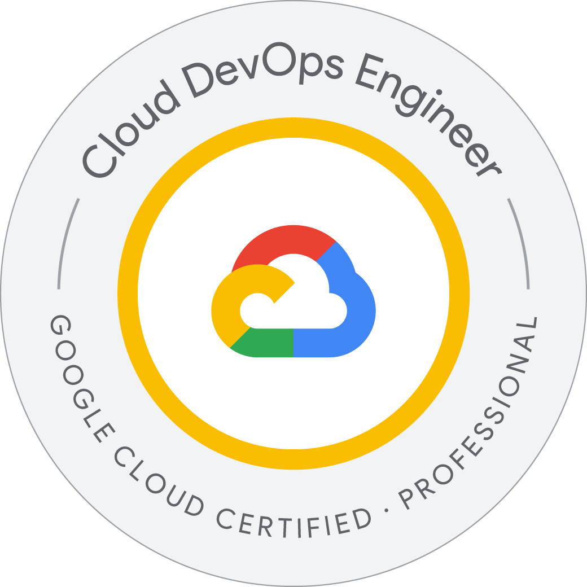

# Certificación de Professional Cloud DevOps Engineer

1. [Aspectos básicos de Google Cloud: Infraestructura principal](sections/section02/Google-Cloud-Fundamentals-Core-Infrastructure.md)
2. [Desarrolla una cultura de SRE de Google](sections/section03/developing-a-google-sre-culture.md)
3. [Infraestructura confiable de Google Cloud: El diseño y el proceso](sections/section04/reliable-google-cloud-infrastructure-design-and-process.md)

---

